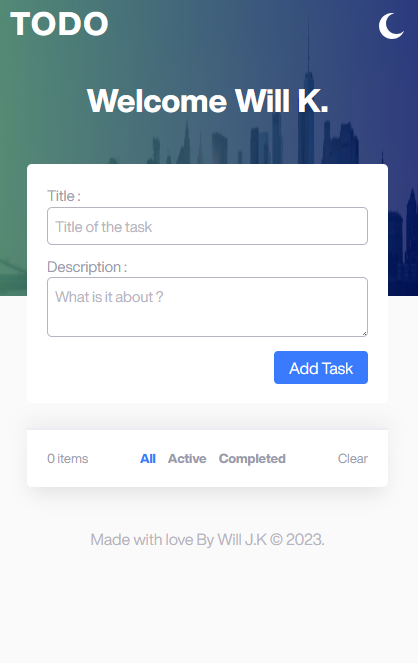
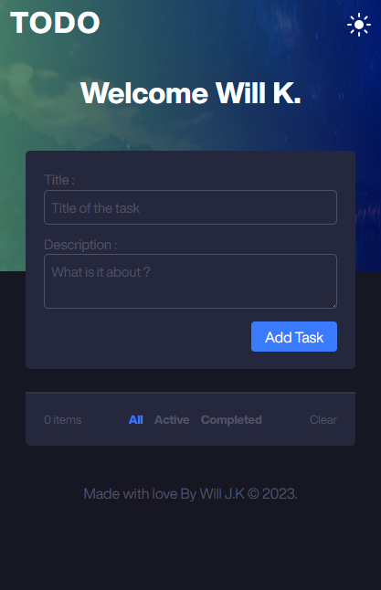

# PHP Challenge

## TODO LIST PHP-MySQL [:link:][link]

### SETUP OF THE APPLICATION

- Download the database.sql file located at app/database.
- Import the sql file into your phpmyadmin.
- Open the config file (located at app/config.php): change your "Home" path to the path of application.
- Open the helper (located at app/helpers/helpers.php): Put you current database credentials and configurations.
- It is all done. Just copy and paste the previous home link of the application on your browser.
- Live demo: https://mozartdevs.com/todo-list

### Full screenshots

---

- At 1500px :computer:

![At 1500px][at1500px-l]

---

- At 1500px :computer:

![At 1500px][at1500px-l-d]

---

- At 1500px :computer:

![At 1500px][gif]

---

- At 375px :iphone:

| Light                                                                       | Dark                                                                       |
| -------------------------------------------------------------------------- | --------------------------------------------------------------------------- |
|  |  |

---

<!-- HTML content -->

WILL J. KEMMOE

<a href="https://mozartdevs.com" title="Portfolio">Portfolio</a> • <a href="https://www.facebook.com/malucie24" title="AI Lucie">My AI</a>

[link]: https://mozartdevs.com/todo-list "Live Demo"
[at1500px-l]: ./assets/images/laptop-1.png "At 1500px"
[at1500px-l-d]: ./assets/images/laptop-2.png  "At 1500px"
[gif]: ./assets/gifs/todo.gif "At 1500px"
